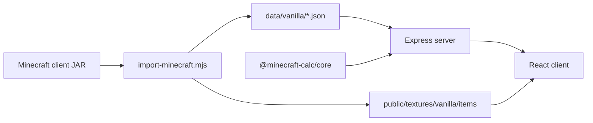

# StackCraft — Technical documentation for AI agents

This file describes the architecture, conventions, and extension points of the **StackCraft** project (`minecraft-material-calc`). Use it as the primary context in new AI iterations before changing code.

## Product purpose

Web material calculator for Minecraft builds. The user specifies **desired items** (quantities) and the system expands **recipes** down to configurable **base materials**, showing totals in units and in **stacks of 64** (inventory stack size).

Two lists in the right panel (always separate):

1. **Build list** — items requested by the user (updates in real time; stacks + remainder).
2. **Materials to craft** — base ingredients after recipe expansion (only after clicking Calculate; disappears when the request list changes or becomes empty).

## Stack

| Layer | Technology |
|-------|------------|
| Runtime | Node.js ≥ 20 |
| Monorepo | npm workspaces |
| Logic | `@minecraft-calc/core` (TypeScript → `dist/`) |
| API | Express 4 (`server/`, port **3847**) |
| UI | React 19 + Vite 6 (`client/`, port **5173**, proxy `/api` and `/textures`) |
| Data | JSON generated in `data/` + PNG in `client/public/textures/` |
| Imported Minecraft version | **26.1.2** (vanilla JAR) |
| Git release tag | **v1.0.0** |

## Repository structure

```
minecraft-material-calc/
├── AGENTS.md                 ← this file
├── README.md                 ← user guide
├── package.json              ← workspaces + root scripts
├── packages/core/            ← calculator (no I/O)
│   └── src/{types,calculator,stacks,index}.ts
├── server/
│   └── src/{index.js,data-loader.js,localize.js}
├── client/
│   ├── src/
│   │   ├── App.tsx           ← main state
│   │   ├── api.ts            ← fetch + setApiLang
│   │   ├── i18n/             ← UI: en (default), pt, es
│   │   ├── components/       ← UI (LanguageSelector, ResultsPanel, …)
│   │   └── hooks/useStackFormat.ts
│   └── public/textures/vanilla/items/*.png
├── data/
│   ├── sources.manifest.json ← enabled sources (vanilla + future mods)
│   └── vanilla/
│       ├── items.json, recipes.json, tags.json, manifest.json
│       └── lang/{en_us,pt_br,es_es}.json  ← item names by language
└── scripts/import-minecraft.mjs
```

## Architecture flow



## Data pipeline (`npm run import:vanilla`)

**Input:** **`MINECRAFT_JAR`** environment variable (required; no default path in the script).

**What the import does:**

1. **Item registry** — only `item.minecraft.*` and `block.minecraft.*` keys from `en_us.json` (unified catalog; does not create phantom items from every block PNG).
2. **Recipes** — `data/minecraft/recipe/*.json`: shaped, shapeless, smelting, blasting, smoking, campfire_cooking, stonecutting.
3. **Tags** — `data/minecraft/tags/item/*.json`; values filtered to the registry.
4. **Icons (`iconPolicy: item-only`)** — one PNG per item in `client/public/textures/vanilla/items/<slug>.png`:
   - Priority: `textures/item/<slug>.png` → models `assets/minecraft/models/item|block/<slug>.json` (layer0, etc.) → single block `textures/block/<slug>.png` if not a multipart part (`_top`, `_bottom`, …).
   - No icon: `hasTexture: false`; UI uses placeholder SVG (do not commit `_missing.png`).
5. **Name translations** — `data/vanilla/lang/en_us.json` from the JAR; `pt_br` and `es_es` downloaded from [minecraft-assets 1.21.4](https://github.com/InventivetalentDev/minecraft-assets) (map `minecraft:<id>` → name).

**Output:** updates `data/sources.manifest.json` with a `vanilla` entry.

## Data model

### `ItemDef` (`packages/core/src/types.ts`)

```ts
{
  id: "minecraft:oak_planks",
  name: "Oak Planks",           // English in items.json; API overrides via lang
  texture: "vanilla/items/oak_planks.png",
  hasTexture?: boolean,
  source: "vanilla"
}
```

### `RecipeDef`

- `resultId`, `resultCount`, `ingredients: { id, count, tag? }`
- Ingredient `id` can be a tag: `#minecraft:planks`

### `CalculateOptions`

- `baseMaterials: ItemId[]` — stop expansion at these items.
- `tagChoices: Record<tagId, ItemId>` — resolve tags (e.g. oak planks).
- `recipeChoices: Record<resultId, recipeId>` — recipe preference (rarely used in the UI).

### Expansion (`MaterialCalculator`)

- Greedy: for each required item, picks a recipe (crafting preferred; otherwise first available).
- `batches = ceil(count / resultCount)`; ingredients multiplied.
- Recipe cycle → treated as a final material (avoids infinite loop).
- No recipe → accumulates in `unresolved` and in the total.

## HTTP API (`server/src/index.js`)

Base: `http://localhost:3847`

| Method | Route | Query/body | Notes |
|--------|-------|------------|-------|
| GET | `/api/health` | — | `version`, `items`, `recipes`, `locales` |
| GET | `/api/items` | `q`, `limit`, **`lang`** | Search by id/name |
| GET | `/api/items/:id` | **`lang`** | Item + recipes |
| GET | `/api/tags/:id` | **`lang`** | `values` + localized `items` |
| POST | `/api/calculate` | body + **`lang`** (query) | See below |
| — | `/textures/*` | — | Static from `client/public/textures` |

**`lang`:** `en` / `en_us` (default), `pt` / `pt_br`, `es` / `es_es`. Implemented in `server/src/localize.js`.

**Language cache:** `langMaps` starts as `null`; do not use empty `{}` as “already loaded” (fixed bug: `langMaps !== null`).

**POST `/api/calculate` body:**

```json
{
  "targets": [{ "id": "minecraft:oak_fence", "count": 30 }],
  "baseMaterials": ["minecraft:oak_log"],
  "tagChoices": { "#minecraft:planks": "minecraft:oak_planks" },
  "recipeChoices": {}
}
```

## React client — state rules (`App.tsx`)

**Invalidate craft result** (`setResult(null)`) when these change:

- `targets` (add, remove, quantity)
- `baseMaterials`
- `tagChoices`

**When all targets are removed:** `ResultsPanel` uses `craftResult = hasTargets ? result : null` — never shows orphaned craft output.

**UI language:** `I18nProvider` → `locale`: `en` | `pt` | `es` (default **en**), `localStorage` key `stackcraft-locale`.

**API language:** `setApiLang(LOCALE_API[locale])` in `useEffect`; all calls in `api.ts` use `?lang=`.

**When `localeTag` changes:** re-fetch item names in `targets` via `fetchItem`.

**Main components:**

| Component | Responsibility |
|-----------|----------------|
| `LanguageSelector` | Flags; closed = circle; open = pill; click when closed opens, when open selects |
| `ItemSearch` | Item autocomplete |
| `ResultsPanel` | Two sections + HTML legend via `t("legend")` |
| `MaterialListSection` | List with `useStackFormat()` |
| `ItemIcon` | Local texture or placeholder SVG |

## Internationalization

### UI (`client/src/i18n/locales/{en,pt,es}.json`)

Keys used in `t("key", { vars })`. English is the fallback if a key is missing.

### Item names (`data/vanilla/lang/*.json`)

Server merges in `localizeItem`. Do not duplicate names in `items.json` for other languages — only update lang JSON after reimport.

## Development commands

```bash
cd /home/lost/Projects/minecraft-material-calc
npm install
MINECRAFT_JAR=/path/to/client.jar npm run import:vanilla
npm run build -w @minecraft-calc/core   # required before server if core changed
npm run dev:server              # :3847
npm run dev:client              # :5173
npm run build                   # production: core + client; server serves client/dist if NODE_ENV=production
```

## Mod extension (planned, not implemented end-to-end)

1. Generate `data/mods/<modid>/` with the same format as `data/vanilla/` (`items.json`, `recipes.json`, `tags.json`, optional `lang/`).
2. Copy textures to `client/public/textures/mods/<modid>/items/`.
3. Register in `data/sources.manifest.json` with `"enabled": true`.
4. `server/src/data-loader.js` already merges all enabled sources; last `itemsById` wins on duplicate ids.

Generalize `scripts/import-minecraft.mjs` or create `import-jar.mjs` parameterized by JAR path + `sourceId`.

## Known limitations

- **~1440 items** without a 2D icon (3D-only models in-game, e.g. fences).
- **pt/es translations** come from 1.21.4 assets — names for new 26.1.2 items may be missing (fallback: `en_us` → `item.name`).
- **One recipe per expansion** — does not optimize global minimum cost; multiple recipes for the same result use a heuristic (crafting first).
- **No 3×3 crafting table grid UI** — ingredient math only.
- Modded recipes with custom NeoForge formats may not parse if JSON diverges from vanilla.

## Conventions for changes (AI)

1. **Minimal scope** — do not refactor outside the request.
2. **Calculation logic** only in `packages/core`; rebuild core after TS changes.
3. **New fields on items/recipes** — update `types.ts`, import script, `data-loader`, API enrichment, and types in `client/src/api.ts`.
4. **UI** — keep Minecraft theme (CSS variables in `global.css` / `app.css`); textures `image-rendering: pixelated`.
5. **Visible text** — add keys in all three `i18n/locales/` JSON files; English default.
6. **Do not commit** `node_modules/`, `.env`, or Minecraft-extracted assets (`data/vanilla/*.json`, `lang/`, `client/public/textures/vanilla/items/*`). Empty folders use `.gitkeep`. Server: `inspectDataFiles` + `dataReady` on `/api/health`; game routes return 503 without import.
7. **Manual test:** 30 `oak_fence` + base `oak_log` + tag planks → **13 oak_log**; remove targets → craft disappears; change language → API names change.

## Relevant decision history

| Decision | Reason |
|----------|--------|
| Catalog from lang item+block only | Avoid `oak_door_top` as a separate item |
| Single `vanilla/items/` folder | One icon per inventory entry |
| `en` default in UI | User request; MC JAR only ships native `en_us` |
| No MC assets in git | License + public repo; local import required |
| `MINECRAFT_JAR` with no default | Avoid machine-specific hardcoded paths |
| Invalidate `result` when list changes | Bug: craft persisted after removing items |
| LanguageSelector without overlay hitarea | Overlay prevented reopening after selection |

---

**Last revised:** aligned with post-v1.0.0 state (i18n, item-only icons, separate build/craft lists).
